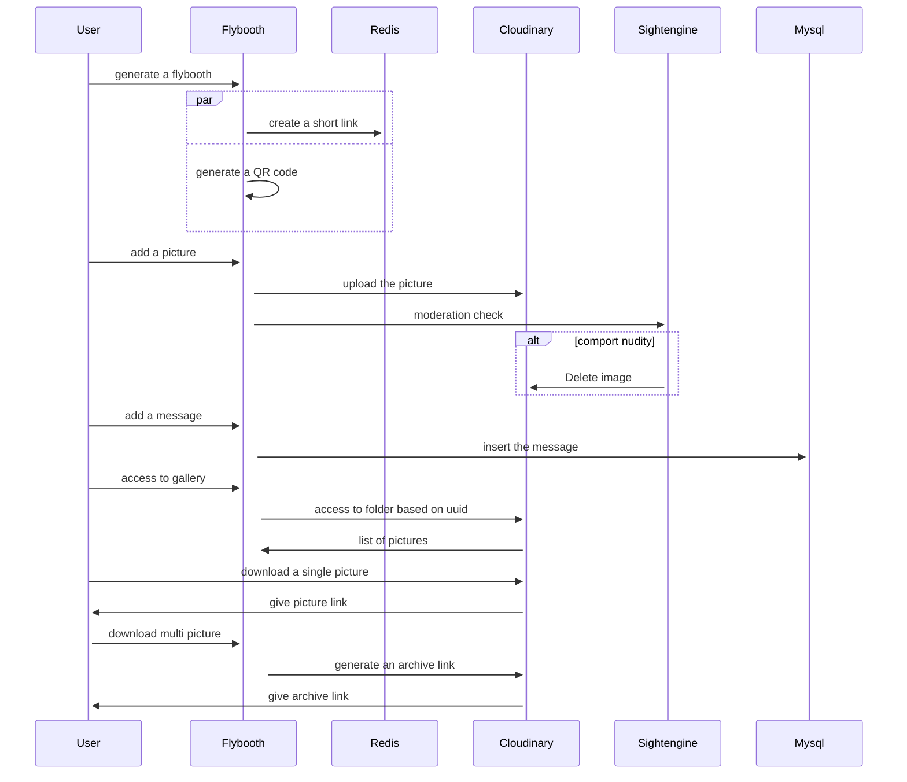
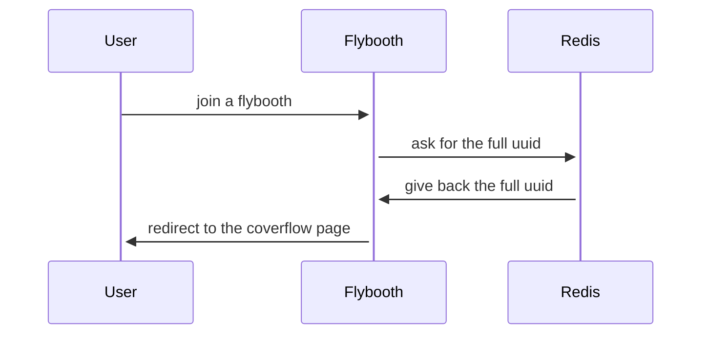
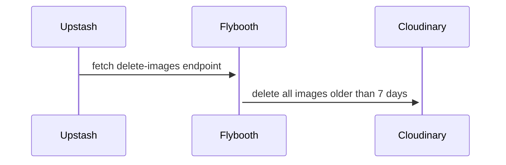

 

<h1 align="center">

 </h1>

<h4 align="center">- Photobooth on fly, from small gatherings to big venues -</h4>

  <a href="#about">About</a> •
  <a href="#features">Features</a> •
  <a href="#tiers">Tiers</a> •
  <a href="#installation">Installation</a> •
  <a href="#architecture-diagram">Architecture Diagram</a>

---

## About

As a venue organizer, I wanted to create an app so people could post some pictures of them during the event and expose them to a central screen. Then give them the ability to download the picture. I wanted to make it open source so people could use it for their own events.

## Features

- Dynamic QR code generation
- Email sending
- Image moderation through IA
- Picture coverflow style
- Picture download (single or bulk)
- Picture upload
- PIN for easy access on external screen
- Internationalization

## Tiers

This project uses free Saas products to run:

- **Backend API**: Vercel
- **Deployment**: Vercel
- **Email sender**: Resend
- **Image moderation**: Sighengine
- **Image optimization**: Vercel
- **Image storage**: Cloudinary
- **Mysql Database**: Turso
- **Redis Database**: Upstash

## Installation

1. Make sure that you have [nodeJS](https://nodejs.org/en/) installed on your machine.
2. Install the dependencies by running `npm install`.
3. Fill environment variables in a `.env.local` file at the root of the project. You can find the list of environment variables in the `.env.local.example` file.
4. Run the development server by running `npm run dev`.
5. (optionnal ) If you want to preview the email template, go to `./component/react-email`, type `npm i` then `npm run dev`.

## Architecture Diagram

### Flybooth workflow

### Join a flybooth

### Auto delete server images

